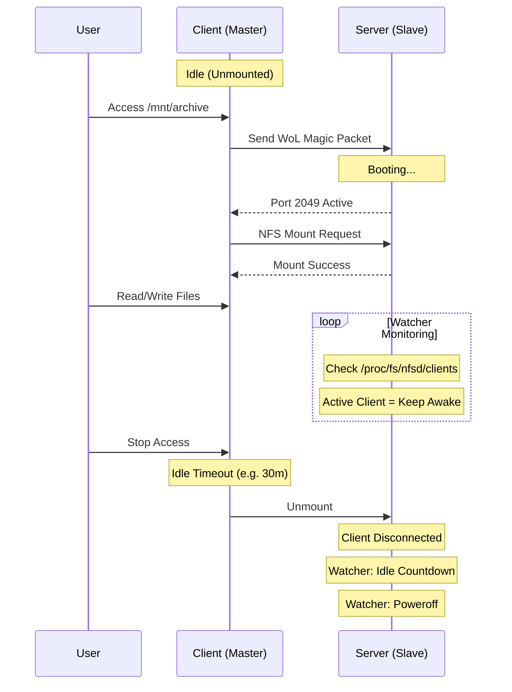
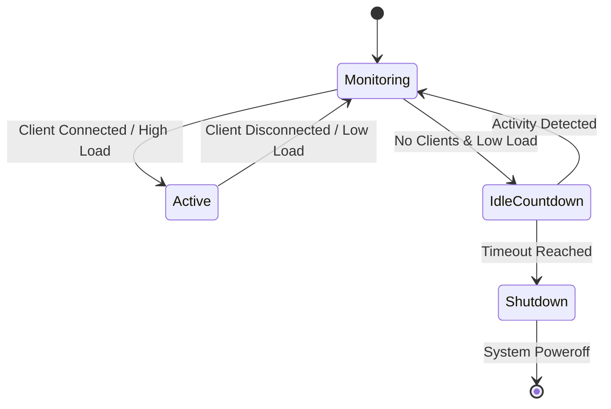

# AutoNFS

> **Intelligent On-Demand NFS Mount Manager** for Home Labs & Energy Saving.
> Wake-on-LAN on Access. Auto-Shutdown on Idle. Zero Configuration.

[](LICENSE)
[](https://goreportcard.com/report/github.com/archroiko/autonfs)

**AutoNFS** is a modern, single-binary replacement for complex `autofs` + scripts setups. It automatically manages the full lifecycle of your remote NAS/Server connection:

1.  **Wake-on-Demand**: Sends Magic Packet (WoL) instantly when you access the mount point.
2.  **Wait-for-Service**: Blocks access until the NFS server is actually ready (preventing timeouts).
3.  **Smart Monitoring**: Precision kernel-level monitoring (`/proc/fs/nfsd/clients`) ensures the server *never* sleeps while you are watching a movie or transferring files.
4.  **Auto-Shutdown**: Powers off the server when truly idle to save energy.

---

## 🔥 Features

*   **⚡️ Zero-Config Deployment**:
    Forget about editing `/etc/auto.master`, `/etc/exports`, or writing custom systemd service files. `autonfs apply` deploys everything (Client Units, Server Watcher, NFS Exports) via SSH in seconds.
*   **🧠 Kernel-Level Accuracy**:
    Unlike scripts that rely on TCP ping or generic load averages, AutoNFS's Watcher inspects the Linux Kernel NFSd state directly. It knows exactly when a client is connected.
*   **🛡️ Atomic & Declarative**:
    Define your infrastructure in `autonfs.yaml`. The deployment is idempotent and self-healing.

---

## 🚀 Quick Start

### 1. Installation

Requires Go 1.20+:

```bash
go build -o autonfs ./cmd/autonfs
```

### 2. Configuration (`autonfs.yaml`)

Create a `autonfs.yaml` file to define your setup:

```yaml
hosts:
  - alias: "high-power-nas"   # SSH Configuration Alias
    idle_timeout: "30m"       # Shutdown after 30m inactivity
    wake_timeout: "120s"      # Wait max 120s for boot
    mounts:
      - local: "/mnt/archive"
        remote: "/volume1/archive"
```

### 3. Deploy

**Dry Run** (Preview changes):
```bash
./autonfs apply -f autonfs.yaml --dry-run
```

**Apply** (Deploy to both local client and remote server):
```bash
./autonfs apply -f autonfs.yaml
```

*   **Idempotency**: Safe to run multiple times. It only updates changed units.
*   **Self-Healing**: Automatically ensures services are enabled and running.

### 4. Undeploy

To remove all configurations and services:

```bash
./autonfs undeploy --local-dir /mnt/archive --remote high-power-nas
```

---

## 🛠️ Architecture

### Workflow



### Watcher State Machine

The watcher runs as a systemd service on the remote server side.



---

## 🧩 Integrations

*   **Nextcloud in Docker**: Use AutoNFS to provide on-demand "Cold Storage" for Nextcloud. See [Nextcloud Integration Guide](docs/integration_nextcloud.md).

## 📜 License

This project is licensed under the **GNU Affero General Public License v3.0 (AGPLv3)**.
See [LICENSE](LICENSE) for details.

---

## ⚠️ Troubleshooting

### Q: Why doesn't the Master unmount automatically?
**A:** Check if you are still inside the mount directory (e.g., shell `cd /mnt/nas`). Please execute `cd ~` to leave the directory, otherwise the mount point will be busy and cannot be unmounted.

### Q: The Slave doesn't shut down after deployment?
**A:**
1.  Check if the Master has unmounted (`mount | grep nfs`).
2.  Check the Slave logs (`journalctl -u autonfs-watcher`) to confirm if there are other clients or high load.
3.  Confirm if `--watcher-dry-run` was enabled.

### Q: Deployment fails with "File not found" or "Permission denied"?
**A:** Please ensure the SSH user has `sudo` privileges. AutoNFS requires sudo to write to `/etc/systemd/system` and `/etc/exports.d` during deployment.
