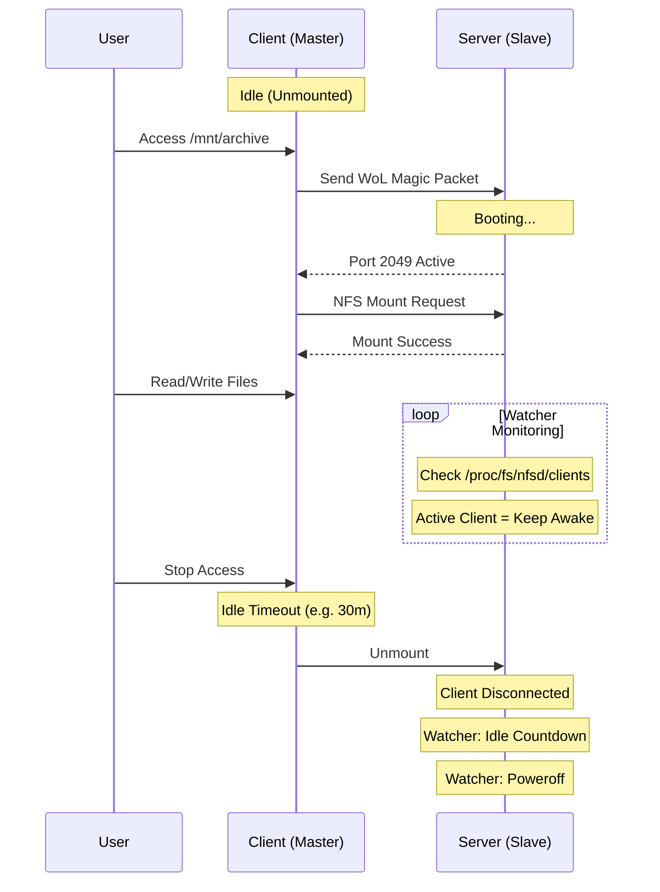
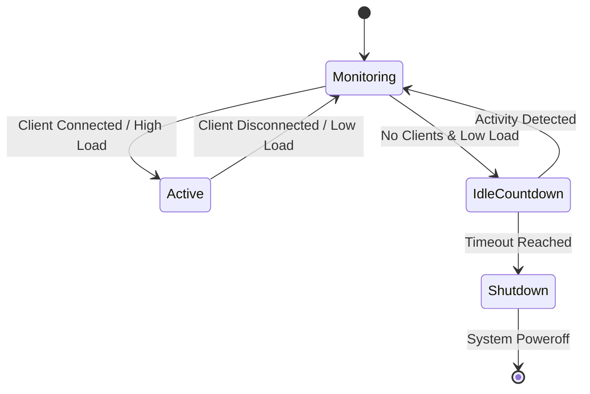

# AutoNFS

> **智慧型按需 NFS 掛載管理器** (Intelligent On-Demand NFS Mount Manager) - 專為 Home Labs 與節能設計。
> 存取時喚醒 (Wake-on-LAN)。閒置時自動關機。零配置。

[](LICENSE)
[](https://goreportcard.com/report/github.com/archroiko/autonfs)

**AutoNFS** 是一個現代化的單一執行檔解決方案，旨在取代複雜的 `autofs` + 腳本設定。它自動管理遠端 NAS/Server 連線的完整生命週期：

1.  **按需喚醒 (Wake-on-Demand)**: 當您存取掛載點時，立即發送魔術封包 (WoL)。
2.  **服務等待 (Wait-for-Service)**: 阻擋存取直到 NFS 伺服器真正就緒 (防止逾時)。
3.  **智慧監控 (Smart Monitoring)**: 精準的核心級監控 (`/proc/fs/nfsd/clients`)，確保在您看電影或傳輸檔案時伺服器*絕不*休眠。
4.  **自動關機 (Auto-Shutdown)**: 當真正閒置時關閉伺服器以節省能源。

---

## 🔥 特色 (Features)

*   **⚡️ 零配置部署 (Zero-Config Deployment)**:
    忘記編輯 `/etc/auto.master`、`/etc/exports` 或撰寫自訂 systemd 服務檔吧。`autonfs apply` 透過 SSH 在幾秒鐘內部署一切 (Client Units, Server Watcher, NFS Exports)。
*   **🧠 核心級精準度 (Kernel-Level Accuracy)**:
    不同於依賴 TCP ping 或一般系統負載的腳本，AutoNFS 的 Watcher 直接檢查 Linux Kernel NFSd 狀態。它確切知道 Client 何時連線。
*   **🛡️ 原子性與聲明式 (Atomic & Declarative)**:
    在 `autonfs.yaml` 中定義您的基礎設施。部署過程具備冪等性 (Idempotent) 與自我修復能力 (Self-Healing)。

---

## 🚀 快速開始 (Quick Start)

### 1. 安裝 (Installation)

需要 Go 1.20+ 環境：

```bash
go build -o autonfs ./cmd/autonfs
```

### 2. 設定 (Configuration) (`autonfs.yaml`)

建立 `autonfs.yaml` 檔案來定義您的設定：

```yaml
hosts:
  - alias: "high-power-nas"   # SSH 設定別名 (SSH Configuration Alias)
    idle_timeout: "30m"       # 閒置 30 分鐘後關機
    wake_timeout: "120s"      # 等待開機最大時間 120 秒
    mounts:
      - local: "/mnt/archive"
        remote: "/volume1/archive"
```

### 3. 部署 (Deploy)

**模擬執行 (Dry Run)** (預覽變更):
```bash
./autonfs apply -f autonfs.yaml --dry-run
```

**執行部署 (Apply)** (部署至本地 Client 與遠端 Server):
```bash
./autonfs apply -f autonfs.yaml
```

*   **冪等性 (Idempotency)**: 可安全地重複執行。它只會更新有變更的單元。
*   **自我修復 (Self-Healing)**: 自動確保服務已啟用並執行中。

### 4. 反部署 (Undeploy)

若要移除所有設定與服務：

```bash
./autonfs undeploy --local-dir /mnt/archive --remote high-power-nas
```

---

## 🛠️ 架構 (Architecture)

### 運作流程 (Workflow)



### Watcher 狀態機 (Watcher State Machine)

Watcher 作為 systemd 服務在遠端 Server 上執行。



---

## 🧩 整合 (Integrations)

*   **Nextcloud in Docker**: 使用 AutoNFS 為 Nextcloud 提供按需掛載的「冷儲存」。詳情請參閱 [Nextcloud 整合指南](docs/integration_nextcloud.md)。

## 📜 授權 (License)

本專案採用 **GNU Affero General Public License v3.0 (AGPLv3)** 授權。
詳細內容請參閱 [LICENSE](LICENSE) 檔案。

---

## ⚠️ 常見問題 (Troubleshooting)

### Q: 為什麼 Master 沒有自動 Unmount？
**A:** 請檢查您是否還停留在掛載目錄內 (例如 shell `cd /mnt/nas`)。請執行 `cd ~` 離開該目錄，否則掛載點會被佔用導致無法卸載。

### Q: 部署後 Slave 一直沒有關機？
**A:**
1.  檢查 Master 是否已經 Unmount (`mount | grep nfs`)。
2.  檢查 Slave 日誌 (`journalctl -u autonfs-watcher`)，確認是否有其他 Clients 或高負載。
3.  確認是否開啟了 `--watcher-dry-run`。

### Q: 部署失敗 "File not found" 或 "Permission denied"？
**A:** 請確認 SSH 使用者有 `sudo` 權限。AutoNFS 部署時需要 sudo 來寫入 `/etc/systemd/system` 與 `/etc/exports.d`。
