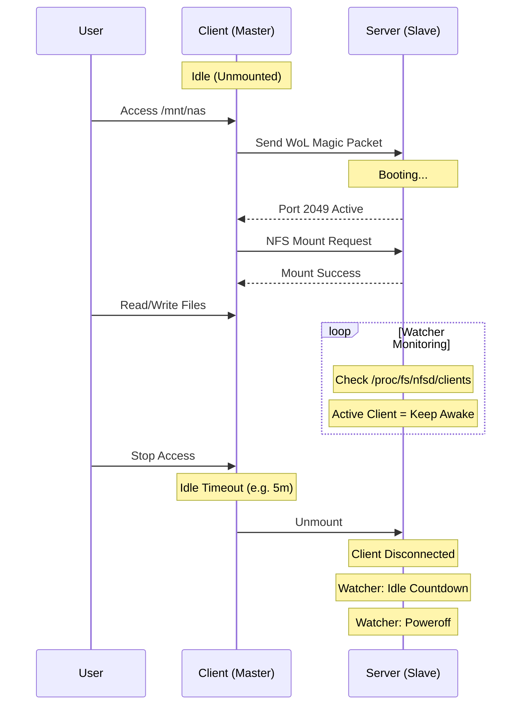
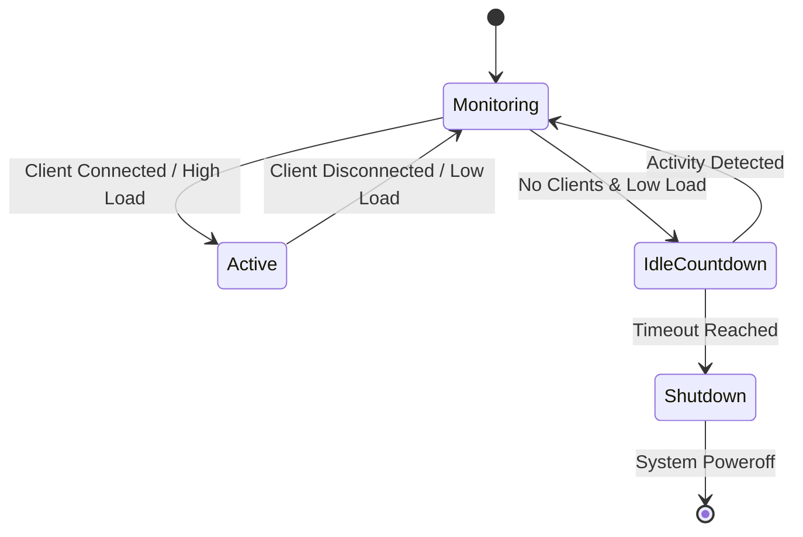

**AutoNFS** 是一個針對「偶爾存取」的 NAS/Server 設計的智慧型 NFS 掛載管理工具。它結合了 **Wake-on-LAN (WoL)**、**Systemd Automount** 與 **Advanced Idle Watcher**，實現「要用時自動喚醒掛載，不用時自動斷線關機」的極致節能體驗。

---

## 🔥 特色 (Features)

*   **⚡️ 按需喚醒 (On-Demand Wake)**
    當您存取掛載點 (如 `ls /mnt/nas`) 時，Master 端會自動發送 WoL 魔術封包喚醒 Slave，並等待 NFS 服務就緒後才完成掛載。完全透明，無需手動執行指令。

*   **🧠 智慧監控 (Smart Watcher)**
    告別傳統不穩定的 TCP 連線偵測。AutoNFS 採用 **多重訊號聚合 (Multi-Source Signal Aggregation)** 技術來精準判定系統狀態：
    1.  **NFSv4 Clients (黃金標準)**: 直接讀取 Kernel `/proc/fs/nfsd/clients/`，只要有 Client 掛載，絕不關機。
    2.  **RPC Operations**: 監控 NFS 操作流量，確保高負載傳輸時不中斷。
    3.  **System Load**: 系統負載過高時自動延後關機。

*   **🛡️ 自動部署 (Atomic Deployment)**
    單一 Binary 包含 Master/Slave 所有邏輯。`deploy` 指令會透過 SSH 自動完成所有配置 (Systemd Unit, NFS Exports, Watcher Service)，並確保原子性更新。

---

## 🚀 快速開始 (Quick Start)

### 1. 安裝 (Installation)

需要 Go 1.20+ 環境：

```bash
# 編譯
go build -o autonfs ./cmd/autonfs
```

### 2. 部署 (Deployment)
推薦使用 **聲明式配置 (autonfs.yaml)** 進行部署，支援多台主機、多重掛載與冪等性更新。

**1. 建立設定檔 `autonfs.yaml`:**
參考 `autonfs.yaml.example` 獲得完整範例：
```yaml
hosts:
  - alias: "nas-server"       # SSH Alias
    idle_timeout: "5m"        # 預設值: 5m
    wake_timeout: "120s"      # 預設值: 120s
    mounts:
      - local: "/mnt/movies"
        remote: "/volume1/movies"
```

**2. 模擬執行 (Dry Run):**
在實際部署前，強烈建議先進行模擬，預覽將發生的變更：
```bash
./autonfs apply -f autonfs.yaml --dry-run
```

**3. 正式部署 (Apply):**
```bash
./autonfs apply -f autonfs.yaml
```
*   **冪等性 (Idempotency)**: 若設定無變更，執行此指令不會重啟服務或覆寫檔案。
*   **自我修復 (Self-Healing)**: 若服務異常停止，執行此指令會嘗試重新啟動。
*   **Watcher Dry Run**: 若想觀察 Watcher 行為但不希望自動關機，可加 `--watcher-dry-run`。

> **Legacy 模式**: 舊版指令式部署仍向下相容：
> ```bash
> ./autonfs deploy myserver --local-dir /mnt/nas --remote-dir /data/files
> ```

### 3. 反部署 (Undeploy)

若要移除設定或發生錯誤：

```bash
# 同時清理本地與遠端 (推薦)
./autonfs undeploy --local-dir /mnt/nas --remote myserver

# 只清理本地
./autonfs undeploy --local-dir /mnt/nas
```

### 4. 進階整合 (Integrations)

*   **Nextcloud**: 將 AutoNFS 應用於 Nextcloud Docker 環境，實現熱拔插外部儲存。詳情請參閱 [Nextcloud 整合指南](docs/integration_nextcloud.md)。

---

## 🛠️ 架構原理解析 (Architecture)

### 運作流程 (Workflow)



### Watcher 生命週期 (State Machine)



### Watcher 狀態監控

您可以透過 SSH 到 Slave 查看即時監控日誌：

```bash
journalctl -f -u autonfs-watcher
```

日誌範例：
```
[ACTIVE] Client Connected (192.168.1.100) | Load: 0.15 | Ops: 52
[IDLE]   Dataset: 0 clients, 0 ops        | Load: 0.05 | Idle: 5m (Shutdown in 25m)
```

---

## ⚠️ 常見問題 (Troubleshooting)

### Q: 為什麼 Master 沒有自動 Unmount？
**A:** 請檢查您是否還停留在掛載目錄內 (Shell `cd /mnt/nas`)。請執行 `cd ~` 離開該目錄，否則掛載點會被佔用導致無法卸載。

### Q: 部署後 Slave 一直沒有關機？
**A:**
1.  檢查 Master 是否已經 Unmount (`mount | grep nfs`)。
2.  檢查 Slave 日誌 (`journalctl -u autonfs-watcher`)，確認是否有其他 Clients 或高負載。
3.  確認是否開啟了 `--watcher-dry-run`。

### Q: 部署失敗 "File not found" 或 "Permission denied"？
**A:** 請確認 SSH 使用者有 `sudo` 權限。AutoNFS 部署時需要 sudo 來寫入 `/etc/systemd/system` 與 `/etc/exports.d`。

---

## 📜 授權 (License)

本專案採用 **GNU Affero General Public License v3.0 (AGPLv3)** 授權。
這與 Nextcloud 的授權模式保持一致，確保所有衍生修改皆回饋於開源社群。

詳細內容請參閱 [LICENSE](LICENSE) 檔案。
